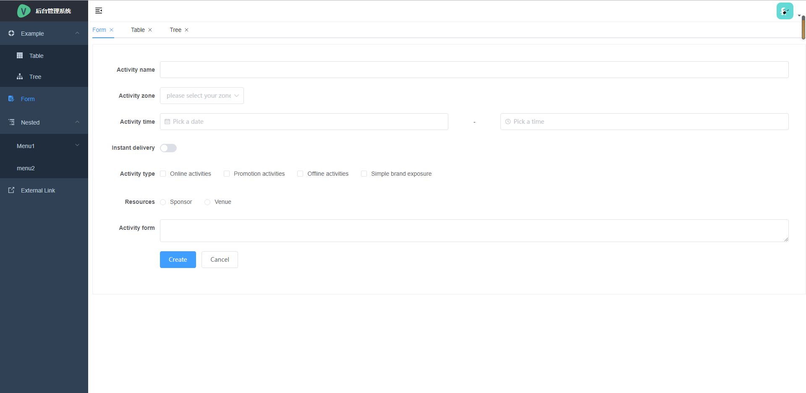

# vue-admin

> 根据 https://github.com/PanJiaChen/vue-admin-template.git 修改 添加了菜单在tab页打开功能

## 截图


## Build Setup
```bash
# 克隆项目
git clone https://github.com/mikewtao/vue-admin.git

# 进入项目目录
 vue-admin-template

# 安装依赖
npm install --registry=https://registry.npm.taobao.org

# 启动服务
npm run dev

